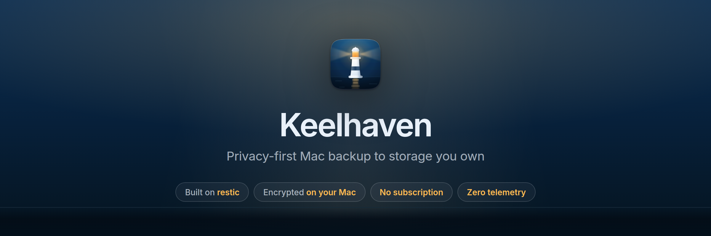

<p align="center">
  
</p>

# Keelhaven

Privacy-first Mac backup to your own storage. One-time purchase, no subscription, no telemetry.

Keelhaven wraps the battle-tested [restic](https://restic.net) engine in a native SwiftUI menu bar app: pick folders, pick a destination you own (external drive, any S3-compatible bucket, or SFTP/NAS), set a schedule — your files are encrypted on your Mac before they leave it.

**Status: early development.** The engine, wizard, scheduled backups, and whole-snapshot restore work; file-level browsing inside snapshots is next.

## Install from CI (personal use)

**Use the install script** — it downloads the newest successful build for your
Mac's architecture, replaces /Applications/Keelhaven.app, strips quarantine,
quits any running copy, and launches the new one:

```bash
./Scripts/install-latest.sh        # needs: brew install gh (authenticated)
```

<details>
<summary>Manual fallback (what the script automates)</summary>

Every CI run on `main` uploads ad-hoc-signed builds as workflow artifacts, one
per architecture: [Actions](../../actions) → latest CI run → download
`Keelhaven-<n>-apple-silicon` (M-series Macs) or `Keelhaven-<n>-intel`.

GitHub wraps every artifact in its own zip, so the download is a **zip inside a
zip**: `Keelhaven-<n>-<arch>.zip` contains `Keelhaven.app.zip`, which contains
the app. Install with:

```bash
cd ~/Downloads
unzip -o Keelhaven-*-apple-silicon.zip      # unwraps GitHub's layer → Keelhaven.app.zip
ditto -x -k Keelhaven.app.zip /Applications # extracts Keelhaven.app (permissions intact)
xattr -dr com.apple.quarantine /Applications/Keelhaven.app
open /Applications/Keelhaven.app
```

Quit the old copy first (menu bar → Quit Keelhaven); a menu-bar app that is
already running shows nothing when you double-click it again.

</details>

The inner `Keelhaven.app.zip` is deliberate: GitHub's own artifact zip does not
preserve executable permissions, so the app is ditto-zipped first — never skip
the second extraction step.

The `xattr` step is required: downloaded apps get macOS's quarantine flag, and
ad-hoc-signed (un-notarized) apps are blocked by Gatekeeper until it's removed.
This is fine for installing on your own Macs; public releases will be
Developer-ID-signed and notarized instead.

## Development setup

Common tasks are wrapped in a thin Makefile — run `make` to list them:

```bash
git clone git@github.com:keelapps/keelhaven.git && cd keelhaven
make bootstrap   # brew install restic xcodegen gh
make test        # KeelhavenCore tests, incl. the real-restic integration suite
make build       # vendor restic + xcodegen generate + Release xcodebuild
make install     # build from source and install to /Applications
make update      # install the latest CI build instead (no local build)
```

The Makefile is a task index only — logic lives in `Scripts/*.sh` and the
standard tools, so `xcodegen generate` + opening `Keelhaven.xcodeproj` in
Xcode works exactly the same.

The app ships with its own copy of restic (universal binary, checksum-verified
against the official release) in `Contents/MacOS/` — end users never install
anything. A user-set path override and Homebrew locations remain as fallbacks.

### Manual smoke test

1. Run the app — it appears in the menu bar only (no Dock icon).
2. *Add Backup Plan…* → 3-step wizard → use a temp folder as a local destination.
3. *Back Up Now* → progress appears in the menu bar → completion notification.
4. Verify independently: `restic snapshots -r <destination-folder>` (with the password you chose).

## Project layout

| Path | What it is |
|---|---|
| `KeelhavenCore/` | SwiftPM package: restic process runner, JSON parsing, models, persistence, schedule math. UI-free and fully unit-tested. |
| `KeelhavenCore/Tests/…/Fixtures/` | Unmodified `restic --json` output captured from restic 0.19.1 — parsers are written against real data, not docs. |
| `Keelhaven/` | SwiftUI app: menu bar, wizard, services (scheduler, notifications, login item, Keychain wiring). |
| `project.yml` | XcodeGen spec — the `.xcodeproj` is generated, never committed. |
| `design/` | Icon and brand kit. `icon.mjs` holds the geometry; `build.mjs` renders the asset catalog, `.icns` and favicons. See `design/README.md`. |
| `site/` | Public website + docs (VitePress). Built and published to `keelapps/keelhaven-site` by `.github/workflows/website.yml`. |
| `docs/ARCHITECTURE.md` | Module boundaries, data flow, and upgrade paths. |

## Security model (v1)

- Repository password and S3 secret key live in the macOS Keychain, one entry per plan.
- Secrets reach restic only through the child process environment — never argv, never disk.
- The restic child gets a minimal clean environment (`PATH`, `HOME`, `TMPDIR`, `SSH_AUTH_SOCK` + credentials), not the app's.
- Zero telemetry. Nothing leaves your machine except your encrypted backups, to the destination you chose.
